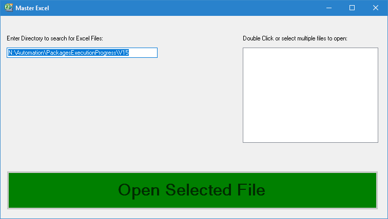
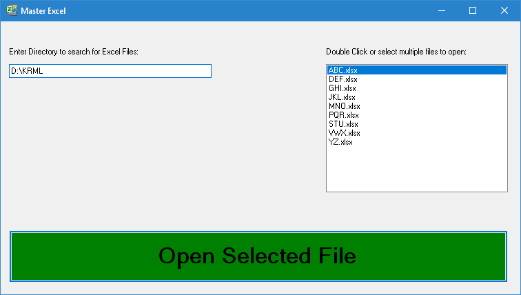
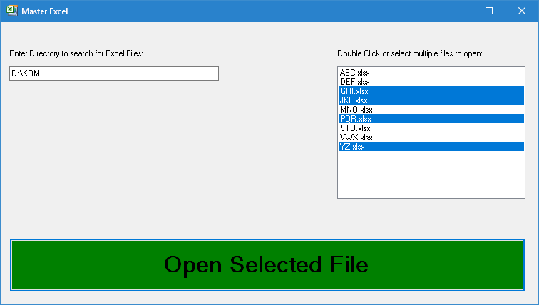
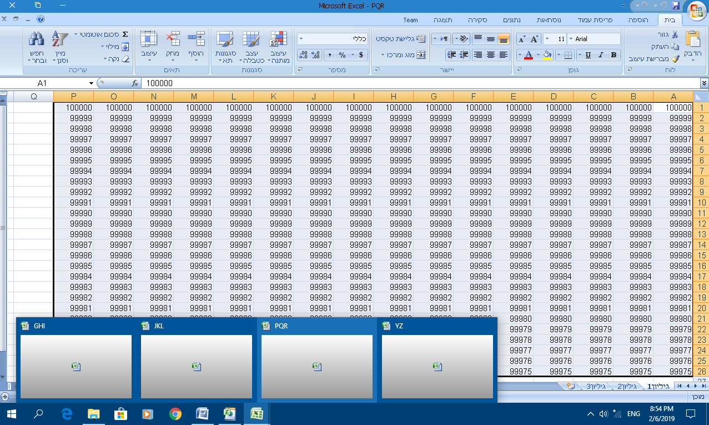

**Master Excel**

**Manages multiple Excel files**

During the last year, I developed a utility, to help locating important Excel
files.

The Main screen of the application looks like that:

Now, we can:

-   Change the directory, to a directory which contains Excel files-\>

The Excel files will be shown inside the files list:

-   Select a single file from the files list, then press "Open Selected File",
    or double-click on the selected file-\>

Excel application will be opened with the selected file.

-   Selecting multiple files from the list, then press "Open Select File"-\>

Excel applications will be opened with the selected files:

**Code location:**

<https://github.com/LiorBob/MasterExcel/blob/master/MasterExcel/frmMasterExcel.cs>
